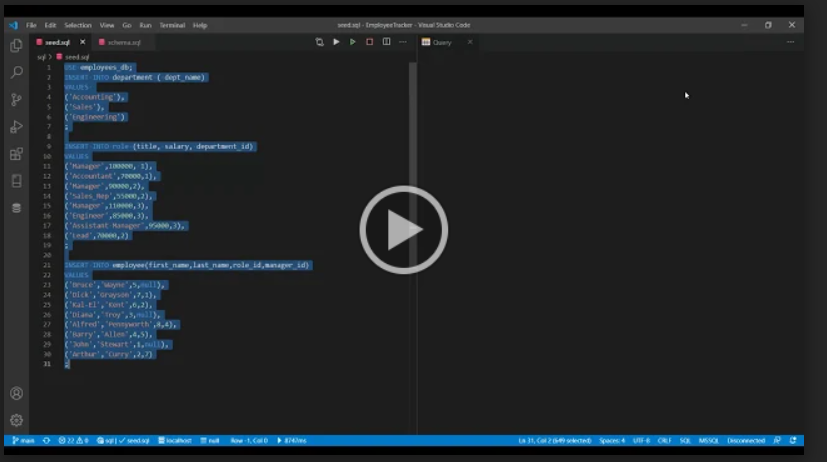

# EmployeeTracker

  [](https://opensource.org/licenses/MIT)
  
  ## Table of Contents
  - [Description](#Description)
  - [Installation](#Installation)
  - [Usage](#Usage)
  - [Tools_&_Technologies](#Tools_&_Technologies)
  - [Code](#Code)
  - [Repo_Link](#Repo_Link)
  - [Example](#Example)
  - [License](#License)
  - [Author_Info](#Author_Info)

## Description
This application is a Content Management System. It will allow you to easily manage your company's employee structure. You can add and delete departments, employee roles, and employees with ease. You can also update an employee's role if they get promoted or switch to a new department. If that happens you can also update their manager accordingly. 

    Note: You will only need to do the installation once.
    
### ⚠️ WARNING ⚠️
- When deleting departments and roles, it will delete in a cascading manner. If you are deleting a department, any role attached to that department will be deleted. This will delete any employee attached to those roles. You should move all employees to their new roles before deleting.

##  Installation
- Install node and MySQL
- Download repo zip file
- Enter "npm i" in VSCode integrated terminal or GitBash/Terminal while in correct folder.
- For database structure, run the schema file located in the SQL folder. 
    - If you have the the MySQL extension in VSCode, you can just run the file. Otherwise copy and paste it in your MySQL workbench. For test data you can also run the seed file located in the SQL folder.


## Usage
### After install 
1. Open VSCode integrated terminal or GitBash/Terminal
2. Path to correct folder
3. Run file by entering "node index.js" or "npm start"
4. Answer prompted questions.

## Tools_&_Technologies
- JavaScript
- Node
- npm Inquirer
- MySQL
- Console.table
- asciiart-logo

## Code
 Create a list of managers for user to choose from
```JS
    managerId() {
        return dbFunctions.viewManagers()
            .then((managers) => {
                const managerChoices = managers.map((manager) => ({
                    value: manager.id,
                    name: `${manager.first_name} ${manager.last_name}`
                }))
                managerChoices.unshift({
                    value: null,
                    name: "No Manager"
                })
                return managerChoices
            })
    },

```
## Repo_Link
- [Employee Tracker Repo](https://github.com/aparnell0130/EmployeeTracker)

## Example
    Click image to play video. For best quality, play video in full screen.

[](https://drive.google.com/file/d/1pSxm7pSf9hNCagdqMrp_Bqa5ICFNjQYZ/view)

## License
- MIT License

Copyright (c) [2021] [Aaron Parnell]

Permission is hereby granted, free of charge, to any person obtaining a copy of this software and associated documentation files (the "Software"), to deal in the Software without restriction, including without limitation the rights to use, copy, modify, merge, publish, distribute, sublicense, and/or sell copies of the Software, and to permit persons to whom the Software is furnished to do so, subject to the following conditions:

The above copyright notice and this permission notice shall be included in all copies or substantial portions of the Software.

THE SOFTWARE IS PROVIDED "AS IS", WITHOUT WARRANTY OF ANY KIND, EXPRESS OR IMPLIED, INCLUDING BUT NOT LIMITED TO THE WARRANTIES OF MERCHANTABILITY, FITNESS FOR A PARTICULAR PURPOSE AND NONINFRINGEMENT. IN NO EVENT SHALL THE AUTHORS OR COPYRIGHT HOLDERS BE LIABLE FOR ANY CLAIM, DAMAGES OR OTHER LIABILITY, WHETHER IN AN ACTION OF CONTRACT, TORT OR OTHERWISE, ARISING FROM, OUT OF OR IN CONNECTION WITH THE SOFTWARE OR THE USE OR OTHER DEALINGS IN THE SOFTWARE. 

## Author_Info
  Github: [aparnell0130](https://github.com/aparnell0130)  
  LinkedIn: [Aaron Parnell](https://www.linkedin.com/in/aaron-parnell-1ab4661b3/)  
  Email: aparnell0130@gmail.com

[Back to top](#EmployeeTracker)
